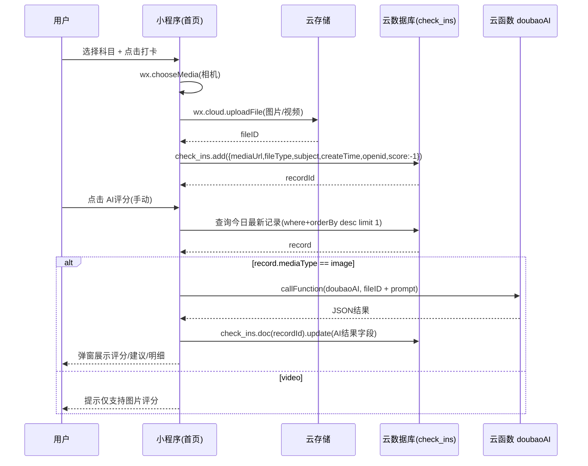

# 学习打卡与单词本小程序（remote_link_pepole）— 概要设计

> 本文档描述“当前项目已实现功能”的概要设计（做什么/怎么分层/关键流程）。  
> 若后续新增功能（如亲子绑定、打卡通知等），应另行补充版本说明与变更记录。

> 适用对象：产品/研发/测试/维护人员  
> 文档目标：快速说明系统“做什么、由什么组成、关键流程是什么”。  
> 技术栈：微信小程序 + 微信云开发（云函数/云数据库/云存储）+ 第三方 AI（豆包/混元）+ 微信 OCR

---

## 1. 背景与目标

本项目是一个面向中小学生/自学用户的**学习打卡与单词学习**小程序，核心目标：

1. 用“打卡”机制促进持续学习（语文/数学/英语等科目）。
2. 对学习内容提供**AI 识别与评价**能力（图片识别题目、判断对错、给出建议）。
3. 支持英语学习的**识词、发音、单词本沉淀与复习**闭环。

---

## 2. 总体架构

### 2.1 架构概览

系统由三部分组成：

- **小程序前端（miniprogram）**
  - 页面：首页/历史/工具箱/拍照识词/单词本
  - 负责：交互、媒体采集、调用云能力、结果展示
- **云开发后台（cloudfunctions + 云数据库 + 云存储）**
  - 云函数：doubaoAI、getUserInfo、ocrGeneral、aiEvaluate、wordAnalyze
  - 云数据库：users、check_ins、wordbook
  - 云存储：存储用户拍摄的图片/视频，供 AI 识别与历史查看
- **第三方能力**
  - 豆包（火山方舟）Responses API：多模态/文本模型推理（项目主要 AI 入口）
  - 腾讯混元：在 `aiEvaluate` 云函数中用于学科评价（部分链路/备用）
  - 微信 OCR（`cloud.openapi.ocr.comm`）：通用文字识别（备用/扩展）
  - 有道 dictvoice：单词发音播放（前端直接播放 URL）

### 2.2 模块划分

| 模块 | 位置 | 主要职责 |
|---|---|---|
| 学习打卡 | pages/index + pages/history | 打卡媒体采集、写入记录、AI评分、历史查询与统计 |
| 工具箱 | pages/toolbox | 聚合入口（识词、单词本） |
| 拍照识词 | pages/scanWord | 上传图片 → AI识词 → 展示单词结构化信息/发音 |
| 单词本 | pages/wordbook | 单词 CRUD、复习筛选、记忆状态、备注 |
| AI统一入口 | cloudfunctions/doubaoAI | 统一多模态/文本模型调用与输出规范化 |
| 用户信息 | cloudfunctions/getUserInfo | 获取当前用户 openId/用户档案（users） |
| OCR | cloudfunctions/ocrGeneral | 微信 OCR 通用识别 |
| AI评分（混元） | cloudfunctions/aiEvaluate | 识别文本 → AI评分 → 写回 check_ins |
| 文本识词 | cloudfunctions/wordAnalyze | 基于 text 的识词（内部调用 doubaoAI） |

---

## 3. 关键业务流程

### 3.1 学习打卡流程（图片/视频上传 + 图片AI评分）

#### 3.1.1 打卡（上传媒体并写库）

1. 用户在首页选择科目（语文/数学/英语）。
2. 点击“打卡”，从**相机**拍摄媒体（图片/视频）。
3. 前端上传到云存储（路径类似 `check_ins/<timestamp>-<rand>.<ext>`）。
4. 前端写入云数据库集合 `check_ins`：记录媒体 fileID、类型、科目、用户 openId、时间等。

> 注意：此时 `score = -1` 表示未评分；AI 评分由用户**手动触发**。

#### 3.1.2 AI评分（手动触发，仅图片）

1. 用户点击“AI评分”按钮。
2. 前端查询“今天 + 当前科目 + 当前用户”的最新打卡记录。
3. 若媒体类型不是 image，则提示“仅支持图片评分”。
4. 若是 image：调用云函数 `doubaoAI`，传 `fileID` + 学科 prompt，要求返回 JSON：
   - recognized_content（识别到内容）
   - total_questions / correct_questions
   - score（0-10）
   - judgment（分析）
   - suggestion（建议）
   - check_results（每题对错明细）
5. 前端将 AI 结果回写到 `check_ins` 对应 doc，并展示弹窗结果。

#### 3.1.3 流程图（Mermaid）

---

### 3.2 历史记录与统计流程

历史页提供：

- 年/月选择（包含“全部月份”）
- 科目选择
- 列表按月分组、支持折叠展开
- 年度总打卡次数、总分
- 奖杯/小红花（每 100 分一个奖杯；每 10 分一朵花，取余换算）

统计口径：

- `totalScore`：按“每天最高得分”累加（同一天多次打卡只取最高分参与总分）。

---

### 3.3 英语识词与单词本流程

#### 3.3.1 拍照识词（scanWord）

1. 用户选择图片（相机/相册）。
2. 上传云存储。
3. 调用 `doubaoAI`（多模态），按规定 JSON 输出单词信息：
   - word/phonetic/meaning/sentences/memoryTips
4. 前端通过有道 dictvoice 播放发音：
   - `https://dict.youdao.com/dictvoice?audio=<word>&type=1`

#### 3.3.2 文本识词（wordAnalyze 云函数）

- 输入：`{ text }`
- 内部：构造 prompt → 调用 `doubaoAI` → 解析 JSON → 返回结构化单词信息并补齐 pronunciationUrl。

#### 3.3.3 单词本（wordbook）

1. 列表展示：从集合 `wordbook` 按创建时间倒序获取，按月份分组。
2. 新增单词：输入文本 → 调用 AI 识别 → 预览确认 → 写入数据库（并做简单去重）。
3. 复习与管理：筛选月份/记住状态，标记 remembered，编辑 remark，播放发音。

---

## 4. 数据概览（高层）

| 集合 | 作用 | 典型字段（摘要） |
|---|---|---|
| users | 用户档案/团队信息（可选） | _openid, nickName, avatarUrl, teamId/teamName, role |
| check_ins | 打卡记录 | mediaUrl, mediaType, createTime, subject, puncherOpenId, score, suggestion, aiAnalysis, recognizedContent, checkResults |
| wordbook | 单词本 | word, phonetic, meaning, sentences, memoryTips, pronunciationUrl, remembered, remark, createTime |

---

## 5. 关键设计点（非功能）

1. **超时控制**：AI 识别与评分调用可能耗时，云函数/前端调用设置超时（如 60s）。
2. **降级策略**：
   - AI 不可用时：识词可使用基础提取（wordAnalyze fallback）；评分链路提示重试。
3. **安全**：
   - 第三方 API Key/Secret 必须使用环境变量或云端安全配置，不应硬编码到仓库。
4. **可观测性**：
   - 云函数打印输入/输出关键日志（但需避免记录敏感信息）。
5. **成本**：
   - 多模态模型调用成本较高；建议限制调用频率与图片大小。

---

## 6. 约束与后续扩展建议

- 当前打卡评分链路以 `doubaoAI` 为主；`ocrGeneral + aiEvaluate` 可作为备用/可扩展链路（例如先 OCR 再评价以降低多模态成本）。
- 可以补充：
  - 用户体系完善（users 建档/昵称头像）
  - 团队/班级排行
  - 单词本复习计划（间隔重复）与错题本

---

## 7. 术语表

- **云开发**：微信提供的 serverless 能力（云函数/数据库/存储）
- **fileID**：云存储文件标识，可换取临时 URL 用于访问
- **打卡**：上传学习内容作为记录，可后续 AI 分析评分
- **check_results**：每题检查明细（题目、用户答案、正确答案、是否正确）
